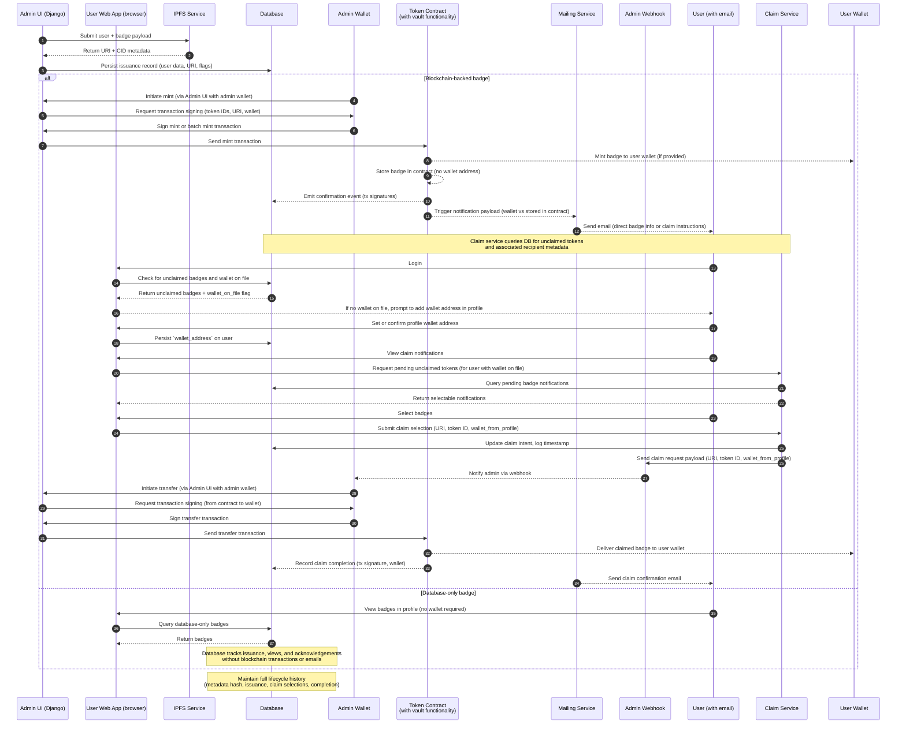
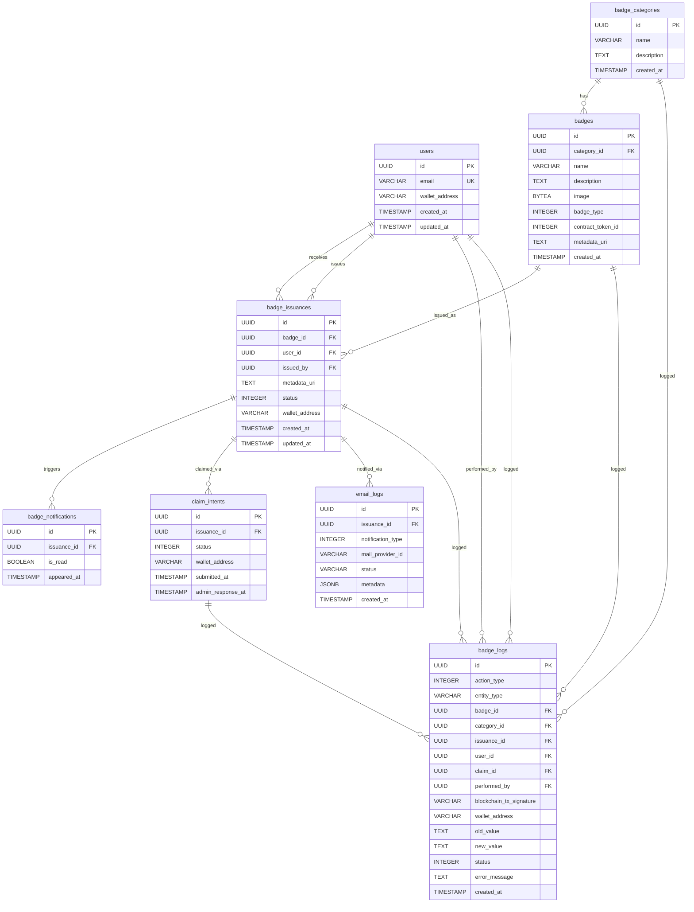

# Boost Badging System – NFT-Integration Plan

## Overview

Solana-based badges are either 
- minted to user wallets (claimed) or 
- stored inside the token contract (unclaimed) until claimed.

---

## End-to-End Workflow

### Admin

1. **Preparation**  
   - Admin retrieves token catalogue and recipient roster after metric evaluation via Admin UI (Django).  
   - Admin selects badge set (single or batch) and recipients.

2. **Metadata & Persistence**  
   - Admin submits badge issuance payload to the IPFS service via Admin UI (Django). 
   - IPFS returns content URI plus derived metadata (hash, gateway URL).  
   - Application persists issuance record in the database, including user data, claim eligibility flags, and URI references.

3. **Minting / Issuance of Blockchain-backed badges**  
     - Admin initiates mint in Admin UI (Django). Browser dApp flow requests transaction signing from the admin's wallet plugin.  
     - Admin signs mint or batch mint transaction (supplying recipient wallet if available, token IDs, and metadata URI).  
     - Browser dApp flow submits the signed transaction to the token contract.  
     - Token contract (with built-in vault functionality) validates call and mints tokens:
       - If wallet provided: Routes tokens directly to user wallets.
       - If no wallet provided: Stores tokens in the contract's internal storage (vault functionality).
     - Token contract emits confirmation event with transaction signatures to the database.
     - Post-confirmation hook triggers notification payload to mailing service (indicating whether badge was sent to wallet or stored in contract).
     - Mailing service sends email to user (no clickable links; instead prompt them to log into boost.org):
       - Claimed-token recipients – badge details including mint transaction ID.
       - Unclaimed-token recipients – claim instructions, emphasizing security posture.

4. **Claim Processing (Unclaimed Tokens Only)**  
   - Admin receives webhook notification when user submits a claim request.
   - Admin initiates transfer in Admin UI (Django). Browser dApp flow requests transaction signing (from contract to wallet).
   - Admin signs transfer transaction.
   - Browser dApp flow submits the signed transfer transaction to the token contract.
   - Token contract delivers the claimed badge to the user wallet.
   - System records claim completion in the database (transaction signature, wallet, timestamp).
   - Mailing service sends claim confirmation email to the user.

5. **Auditing & Reporting**  
   - Admin accesses dashboard to view mint/claim status, IPFS hashes, and notification delivery logs.
   - Database maintains full lifecycle history (metadata hash, issuance, claim selections, completion).

---

### User

**Claiming Badges (Unclaimed Tokens Only)**  
   - User logs into the User Web App.
   - If the user has unclaimed blockchain-backed badges and no wallet address on file, the User Web App notifies them that they have unclaimed badges and guides them to create a wallet (if needed) and set a primary wallet address in their user profile.
   - Once a wallet address is set in the user profile, the User Web App displays the user's unclaimed blockchain-backed badges.
   - User selects one or more badges and submits the claim request (no per-claim wallet entry; the profile wallet is used).
   - User Web App sends the claim selection (URI, token ID) together with the user's profile `wallet_address` to the claim service.
   - Claim service updates the database with claim intent details (URI, token ID, wallet_address, timestamp).
   - Claim service sends claim request payload (URI, token ID, wallet_address) to the admin webhook.
   - User waits for admin to process the claim request.
   - User receives claim confirmation email once the badge is transferred to their wallet.

---

## Workflow Diagram

---

## Database Schema

**Note on `wallet_address` in `users` table**: The `wallet_address` field in the `users` table is used both to support batch minting operations by admins and to drive the user-initiated claim flow. When an admin executes a batch-mint action, it would be impossible to manually input all wallet addresses for each recipient. Therefore, users who have a wallet address should set it in their profile page. If a user has not set their wallet address, their badge tokens are automatically minted to the token contract (vault functionality) instead of directly to their wallet, requiring them to claim the badge later. When a user later claims an unclaimed badge, the system uses the `wallet_address` stored on the user profile (rather than letting the user enter multiple arbitrary wallets per claim).
