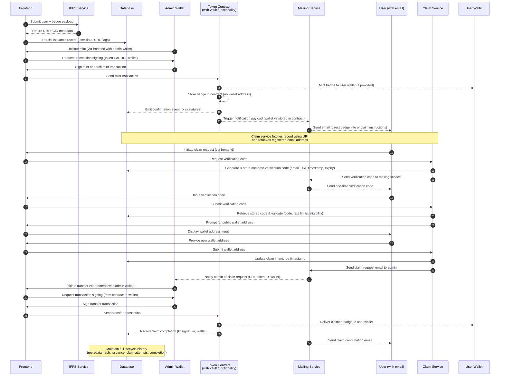

# Boost Badging System – NFT Integration

## Overview

This document outlines a Solana-based badging flow that mints directly to recipient wallets or stores badges in the token contract (when no wallet is provided), supports email-triggered claims, and records all badge lifecycle events. The token contract includes built-in vault functionality for storing unclaimed badges. The implementation window is estimated at three weeks.

---

## End-to-End Workflow

1. **Preparation**  
   - Frontend retrieves token catalogue and recipient roster.  
   - Admin selects badge set (single or batch) and recipients.

2. **Metadata & Persistence**  
   - Frontend submits badge issuance payload to the IPFS service.  
   - IPFS returns content URI plus derived metadata (hash, gateway URL).  
   - Application persists issuance record in the database, including user data, payload hash, claim eligibility flags, and URI references.

3. **Minting**  
   - Admin initiates mint via frontend with admin wallet. Frontend requests transaction signing from admin.  
   - Admin signs mint or batch mint transaction (supplying recipient wallet if available, token IDs, and metadata URI).  
   - Frontend sends the signed transaction to the token contract.  
   - Token contract (with built-in vault functionality) validates call and mints tokens:
     - **If wallet provided**: Routes tokens directly to user wallets.
     - **If no wallet provided**: Stores tokens in the contract's internal storage (vault functionality).

4. **Notification**  
   - Post-confirmation hook (webhook or listener) enqueues email template jobs.  
   - Mailing list service delivers:  
     - **Direct wallet recipients** – badge details and blockchain links.  
     - **Contract-stored recipients** – claim instructions, emphasizing security posture.

5. **Claim (Contract-Stored Tokens Only)**  
   - User initiates claim request via frontend (using claim service link from email). Frontend requests verification code from claim service.  
   - Claim service looks up issuance by URI and extracts the registered email.  
   - Claim service generates and stores one-time verification code in database (with email, URI, timestamp, expiry) and sends it to mailing service.  
   - Mailing service sends one-time verification code to user via email and enforces rate limits.  
   - User inputs verification code through frontend. Frontend submits code to claim service.  
   - Claim service retrieves stored code from database and validates (code, rate limits, eligibility).  
   - On success, frontend prompts user for a self-custodial public wallet address.  
   - User provides wallet address through frontend. Frontend submits wallet address to claim service.  
   - Claim service updates claim intent in database and sends claim request email to Admin, including URI, token ID, and user's wallet address.  
   - Admin receives claim request notification via email.  
   - Admin initiates transfer via frontend with admin wallet. Frontend requests transaction signing from admin.  
   - Admin signs transfer transaction (from contract storage to user wallet). Frontend sends the signed transaction to token contract.  
   - System updates database with claim completion timestamp, destination wallet, and transaction signature.  
   - Confirmation email is sent to the claimant.

6. **Auditing & Reporting**  
   - Dashboard surfaces mint/claim status, IPFS hashes, and notification delivery logs.  
   - Scheduled jobs reconcile on-chain state with database records.

---
