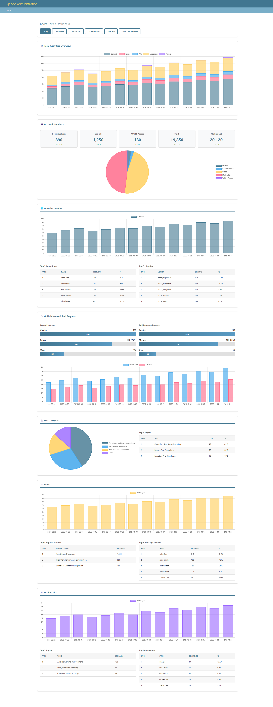

# Boost Unified Dashboard Plan

## Why Chart.js

Chart.js is easy to implement and provides a straightforward API for creating various chart types with minimal configuration.

Existing Django admin chart packages are difficult to customize to match our specific requirements. They offer limited flexibility in chart types, layouts, and styling options, making it hard to integrate custom business logic and data aggregation needs.

Django SQL chart packages require manual SQL queries which is not maintainable. Writing raw SQL for each chart increases complexity and reduces code reusability. It becomes difficult to maintain and update as requirements change, and lacks the flexibility of Django ORM for complex data relationships.

## Sections

1. Time Period Filters

   Filter dashboard data by time range: Today, One Week (7 days), One Month (30 days), Three Months (90 days), One Year (365 days), or From Last Release.

2. Total Activities Overview

   Display total activity counts across all platforms for quick comparison with timeline. Displayed as bar chart showing total commit numbers, GitHub issues/PRs, mailing list messages, Slack messages, WG21 papers, and website accounts over time (time series).

3. Account Numbers

   Display total registered accounts across all platforms as pie chart and summary cards with improvement indicators (↑/↓ trends).

4. GitHub Commits

   Track commit activity with top contributors, and most active libraries. Displayed as bar chart for commit numbers by date (time series), tables for top 5 committers and top 5 libraries.

5. GitHub Issues & PRs

   Monitor issue and pull request lifecycle with creation, resolution, and engagement metrics. Displayed as progress bars for issues (created vs solved) and PRs (created vs merged), plus stacked bar chart for comments and reviews over time.

6. WG21 Papers

   Display paper contributions with topic distribution analysis. Displayed as pie chart for topic distribution and table for top 3 topics.

7. Slack

   Analyze Slack activity including active topics/channels, and most active participants. Displayed as bar chart for messages by date (time series), tables for top 3 topics/channels and top 5 message senders.

8. Mailing List

   Track mailing list engagement with popular topics, and top contributors. Displayed as bar chart for messages by date (time series), tables for top 3 topics and top commentors.

## Implementation

1. Real-Time Updates

   Implement real-time dashboard updates using AJAX polling mechanism that refreshes data every 30-60 seconds. Utilize Django cache framework to optimize performance with 30-second cache for "Today" period and 5-minute cache for longer time periods. Future enhancement will include WebSocket support via Django Channels for true real-time updates.

2. Chart Library

   Use Chart.js library for all dashboard visualizations including bar charts, pie charts, progress bars, and summary cards. All charts will be responsive and match the Django admin theme for consistent user experience across different devices.

3. Backend

   Build efficient Django views with optimized database queries using PostgreSQL. Implement caching layer to reduce database load and improve response times. Use Celery tasks for asynchronous data collection from external sources (GitHub, Slack, mailing lists, etc.) to keep the dashboard data up-to-date without blocking the main application. Dashboard data is updated daily using Celery tasks that collect data from external sources. Pre-aggregated data in combined tables provides better performance than real-time queries. Combining related tables improves query performance and reduces database load during dashboard rendering.

## Test

1. Unit Tests

   Write unit tests for each database query function that retrieves data for dashboard sections to verify correct data retrieval and filtering.

   - Test time period filter calculations for Today, One Week, One Month, Three Months, One Year, and From Last Release date ranges.
   - Test Total Activities Overview queries for aggregating commit numbers, GitHub issues/PRs, mailing list messages, Slack messages, WG21 papers, and website accounts over time.
   - Test Account Numbers queries for retrieving total registered accounts per platform (GitHub, Slack, mailing list, website) with trend calculations.
   - Test GitHub Commits queries for commit counts by date, top 5 committers aggregation, and top 5 libraries aggregation.
   - Test GitHub Issues & PRs queries for created vs solved issues, created vs merged PRs, and comments/reviews aggregation over time.
   - Test WG21 Papers queries for topic distribution aggregation and top 3 topics retrieval.
   - Test Slack queries for message counts by date, top 3 topics/channels aggregation, and top 5 message senders aggregation.
   - Test Mailing List queries for message counts by date, top 3 topics aggregation, and top commentors aggregation.
   - Test edge cases including empty datasets, invalid date ranges, missing external data sources, and null value handling.

2. Integration Tests

   Test complete data flow from database queries through view processing to JSON response generation for all AJAX endpoints.

3. Q/A Testing

   Perform quality assurance testing for frontend including Chart.js rendering, responsive design, interactive features, and cross-browser compatibility.

4. Performance Tests

   Measure dashboard load times and query performance with different data volumes to ensure response times meet requirements.

5. End-to-End Tests

   Test complete user workflows including dashboard access, time period selection, data viewing, and real-time updates.

## Timeline (3 weeks)

