## Need for a Separate `Contribution` App

### Github Author grouping issues and mitigation plan

1. Current state: the admin action `merge_authors` (libraries/admin.py ~131-140) calls `CommitAuthor.merge_author` (libraries/models.py ~80-96). That method rewrites `Commit`, `CommitAuthorEmail`, and `EmailData` records and deletes the secondary author. There is no verification gate, so a single mistake may permanently merge unrelated contributors.

2. Why email verification before merging is not the final answer:

    - Requiring legacy contributors to prove email ownership is unrealistic. People lose access to old mailboxes or switch providers, so their data would remain fragmented forever.
    - Many commits arrive through GitHub no-reply addresses such as `*@users.noreply.github.com`. Those aliases cannot be verified, yet they represent real work. Blocking them would split history for entire projects.
    - As mentioned in 1, merges are irreversible. Even with verification, an error would still rewrite commit history and there is no undo path.
      Given these constraints, the safer approach is to leave commit authors untouched and use a reversible grouping layer.

3. Mitigation plan in a separate `Contribution` app:
    - Create an `Identity` table that represents the human contributor (display name, description, `needs_review`, timestamps). `CommitAuthor` rows will point to an identity instead of another author.
    - Create an `EmailIdentityRelation` table with (`email`, `identity`, `created_at`). This keeps a reversible history of which addresses belong to which person. Adding or removing rows never touches commit history.
    - Add a dedicated `Email` table so each address is stored once and linked to multiple identities. Admins regroup authors by moving the identity pointer, which keeps merges reversible and eliminates the need for strict email verification.
    - Implement AI-driven identity suggestions, but require human approval through the admin UI to ensure accuracy before groups affect reporting.

### GitHub contribution coverage gap

1. `website-v2` stores only top-level `Issue` and `PullRequest` metadata (title, number, state, timestamps, GitHub ID, JSON blob). It never imports PR review events or issue comments, so we cannot credit reviews or discussions.

2. We will build a contribution log (single table) that records every GitHub contribution type in one place. Each record will include:

    - Email FK to the claimed contributor (once the grouping layer links authors to real accounts).
    - `type` field capturing every GitHub activity we care about: `commit`, `pr-create`, `pr-review`, `pr-approve`, `pr-merge`, `pr-close`, `issue-create`, `issue-comment`, `issue-close`.
    - `date`, `repo`, `info` (PR or issue number or commit hash), and a `comment` with title and body text.
    - Indexes on email, date, type, and repo so reports and admin filters stay fast.

3. Import tasks will read GitHub review/comment feeds and upsert these contribution rows. Because commits remain untouched under the new grouping approach, staff can reassign an identity group without rewriting historical contribution data.

---

## Suggested Models in `Contribution` App

```mermaid
erDiagram
    Email {
        int id PK "AutoField, Primary Key — unique identifier for each contributor email record"
        string email UK "EmailField, max_length=255, Indexed — contributor's email address (unique)"
        datetime created_at "DateTimeField, auto_now_add — timestamp when record created"
        datetime updated_at "DateTimeField, auto_now — timestamp when record last updated"
    }

    Identity {
        int id PK "AutoField, Primary Key — unique identifier for each identity"
        string name "CharField, max_length=255, nullable — identity name"
        text description "TextField, nullable — human-readable description of the identity"
        m2m emails "ManyToManyField -> Email through EmailIdentityRelation — linked contributor emails"
        boolean needs_review "BooleanField, default=False — flag for AI-generated identities needing manual review"
        datetime created_at "DateTimeField, auto_now_add — timestamp when identity created"
        datetime updated_at "DateTimeField, auto_now — timestamp when identity last updated"
    }

    EmailIdentityRelation {
        int id PK "AutoField, Primary Key — unique identifier for each email-identity link"
        int email_id FK "ForeignKey -> Email.id, CASCADE — linked contributor email"
        int identity_id FK "ForeignKey -> Identity.id, nullable, CASCADE — linked identity"
        datetime created_at "DateTimeField, auto_now_add — timestamp when relation created"
    }

    User {
        int id PK "AutoField, Primary Key — unique identifier for each user record"
        int email_id FK "ForeignKey -> Email.id, CASCADE, Indexed — contributor email for this user profile"
        string name "CharField, max_length=255, nullable — contributor's full name"
        string info "CharField, max_length=255, nullable — extra info (e.g., GitHub username)"
        string source "CharField, max_length=255, choices=USER_SOURCES, Indexed — origin of data (github/wg21/etc.)"
        datetime created_at "DateTimeField, auto_now_add — timestamp when user record created"
        datetime updated_at "DateTimeField, auto_now — timestamp when user record last updated"
    }

    GitHubContribution {
        int id PK "AutoField, Primary Key — unique identifier for each GitHub contribution"
        int email_id FK "ForeignKey -> Email.id, CASCADE, Indexed — contributor email tied to the event"
        string type "CharField, max_length=50, choices=CONTRIBUTION_TYPES, nullable, Indexed — category of contribution"
        datetime date "DateTimeField, nullable, Indexed — when the contribution occurred"
        string repo "CharField, max_length=255, nullable, Indexed — repository name for the contribution"
        text comment "TextField, nullable — comment/message linked to the event (UI limits 30 characters)"
        string info "CharField, max_length=255, nullable — extra info (commit hash, PR number, issue number)"
    }

    Wg21Contribution {
        int id PK "AutoField, Primary Key — unique identifier for each WG21 paper contribution"
        int email_id FK "ForeignKey -> Email.id, CASCADE, Indexed — contributor email tied to the contribution"
        int year "IntegerField, nullable, Indexed — year of the contribution"
        string title "CharField, max_length=255, nullable — title of the paper where the contribution was made"
        string paper_id "CharField, max_length=255, nullable — paper ID where the contribution was made"
    }

    Email ||--o{ EmailIdentityRelation : "has many (email_id)"
    Identity ||--o{ EmailIdentityRelation : "has many (identity_id)"
    Email ||--o{ GitHubContribution : "has many (email_id)"
    Email ||--o{ Wg21Contribution : "has many (email_id)"
    Email ||--o{ User : "has many (email_id)"

    EmailIdentityRelation }o--|| Email : "belongs to (email)"
    EmailIdentityRelation }o--|| Identity : "belongs to (identity)"
    GitHubContribution }o--|| Email : "belongs to (email)"
    Wg21Contribution }o--|| Email : "belongs to (email)"
    User }o--|| Email : "belongs to (email)"

    Identity }o--o{ Email : "many-to-many through EmailIdentityRelation"
```

## Remark

- Email Model: unique on `email` with dedicated index for fast lookups.

- EmailIdentityRelation Model: unique on `(email, identity)` ensuring each email-identity pair is only stored once, while allowing optional identities for imported emails.
